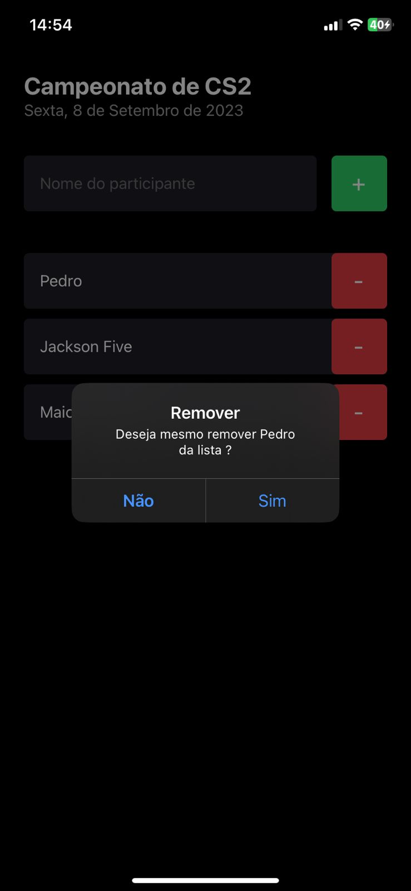

<h1 align="center">
    
</h1>

<p align="center">
  <a href="#about">About</a> •
  <a href="#features">Features</a> •
  <a href="#how-it-works">How to run the application</a> • 
  <a href="#tech-stack">Techs used</a>
</p>

<div align="center" style="display: flex; gap: 12px;">
   
   
   
</div>

## About

ImHere is a mobile app to create event lists and manage participants.

This project was developed during the Ignite Course from [Rocketseat](https://www.rocketseat.com.br/ignite).

---

## Features

- [x] Creates a list of participants for an event
- [x] Add Participants
- [x] Remove Participants

---

## How to run the application

You will need to have [Git](https://git-scm.com), [Node.js](https://nodejs.org/en/) and [Expo](https://expo.dev) (in your phone, otherwise need some phone emulator like adroid studio) installed to run the project:

#### Running the app

```bash

# Clone this repository
$ git clone https://github.com/Pdro-marqss/imhere.git

# Access the project folder in your terminal
$ cd imhere

# Install the dependencies
$ npm install

# Run the application in development mode using expo
$ npx expo start

#Use Expo Go to run the app in your phone

```

---

## Techs used

Tools used in the construction of this project:

- **[React-Native](https://reactnative.dev)**
- **[Expo](https://expo.dev)**
- **[Typescript](https://www.typescriptlang.org/)**
- **[Styled Components](https://styled-components.com/)**

---
